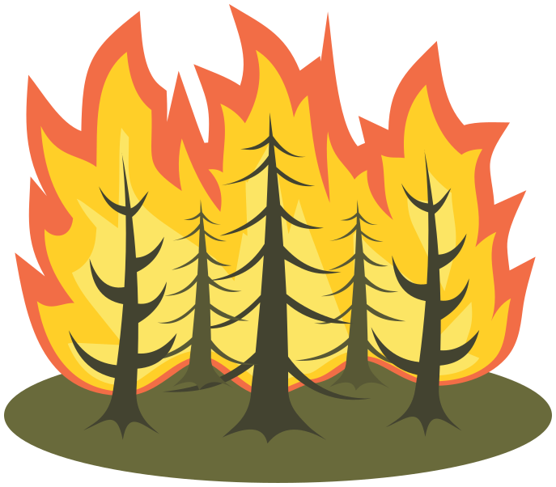

# Forest fire prevention and detection

<p align=center>
    <br/>
    <span>Project realized by <a href="https://github.com/06Games">Evan Galli</a>, <a href="https://github.com/JokerOnWeed">Anthony Vasta</a> and <a href="https://github.com/sachaCast">Sacha Castillejos</a>
    <br/>as part of the <b>Fundamentals and challenges of cyber-physical systems</b>, <b>From IoT to cyber-physical systems</b> and <b>Development of cyber-physical systems</b> courses.</span>
</p>

## Overview

This project simulates and monitors forest fires using a distributed cyber-physical system architecture. It collects sensor data from an edge environment, processes it in a fog layer, and visualizes it in the cloud.

> [!NOTE]  
> Some AI tools, including GitHub Copilot and Google Gemini, were used to help write parts of the code and documentation.

## Getting Started

### Prerequisites

[Docker](https://docs.docker.com/engine/install/) and [Docker Compose](https://docs.docker.com/compose/install/linux/) must be installed on your machine to run the project.

[UV](https://docs.astral.sh/uv/) is required to run the simulation outside of Docker.

### Running the Project

The entire stack can be launched using the main compose file:

```bash
docker compose up -d --build
```

You might want to start the simulation manually to see the GUI updating in real-time:

```bash
docker compose stop simulation && uv --directory src/edge/simulation run main.py
```

You can do the same for the propagation service:

```bashbash
docker compose stop propagation && uv --directory src/fog/propagation run main.py
```

### Accessing Services

| Service              | URL                                            | Description               | Credentials                                   |
| -------------------- | ---------------------------------------------- | ------------------------- | --------------------------------------------- |
| **Web Application**  | [http://localhost](http://localhost)           | Main Dashboard            |                                               |
| **Redpanda Console** | [http://localhost:8080](http://localhost:8080) | Kafka/Redpanda Management |                                               |
| **MinIO Console**    | [http://localhost:9090](http://localhost:9090) | Storage Management        | User: `minioadmin`, Password: `minioadmin123` |
| **InfluxDB**         | [http://localhost:8086](http://localhost:8086) | Time Series Database      | User: `admin`, Password: `adminpass123`       |

## Architecture

The system is divided into three layers:

*   **Edge**: 
    * **Simulation**: Simulates environmental sensors (Temperature, Humidity, etc.) and sends data via MQTT.
    * **Treatment**: Receives raw sensor data, applies initial filtering, and forwards it to the fog layer via MQTT.
*   **Fog**:
    *   **Pre-treatment**: Rust service to clean and format raw sensor data.
    *   **Propagation**: Python service to calculate fire spread risks.
*   **Cloud**:
    *   **GeoJSON Producer**: Generates map data for the frontend.
    *   **API**: Rust backend serving data.
    *   **Web UI**: React application for visualization.

## Technologies

*   **Languages**: Rust, Python (with uv), TypeScript (SolidJS/Bun/Vite)
*   **Messaging**: MQTT (Mosquitto), Kafka (Redpanda)
*   **Storage**: MinIO, InfluxDB
*   **Infrastructure**: Docker

## Demo

https://github.com/user-attachments/assets/3e4292e0-58c5-4bed-bbf1-a76257120b20

<table>
    <tr>
        <td></td>
        <td></td>
    <tr>
    </tr>
        <td></td>
        <td></td>
    <tr>
    </tr>
        <td></td>
        <td></td>
    <tr>
    </tr>
        <td></td>
        <td></td>
    </tr>
</table>


